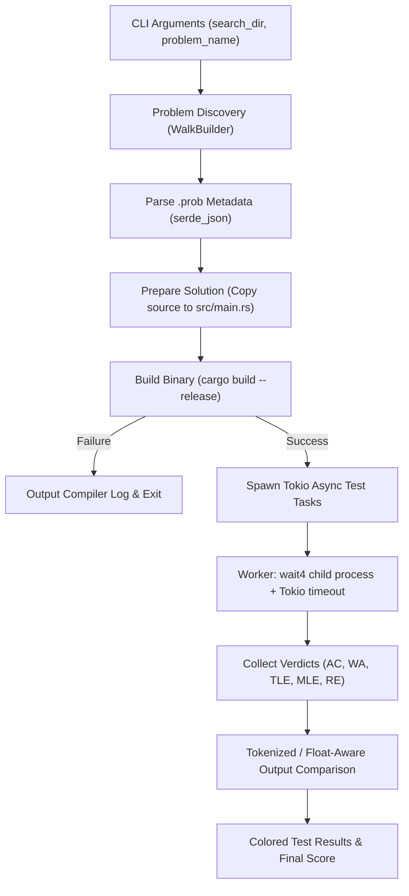

# Architecture: `cph_judge`

## Overview

`cph_judge` is a fast, parallel competitive programming judge written in Rust. It integrates with Competitive Companion / CPH problem metadata (`.prob` files), manages compilation of solution binaries, and evaluates test cases concurrently against resource limits (time, memory) and expected outputs.

---

## System Pipeline

---

## Key Modules and Components

### 1. Problem Discovery (`find_prob_file`)
- Uses `ignore::WalkBuilder` to traverse `search_dir` recursively.
- Finds `.prob` JSON files matching the specified target problem name.
- Resolves project root directory by inspecting parent directory structures.

### 2. Configuration & Metadata (`CphConfig`)
- Parses `.prob` files generated by Competitive Companion / CPH:
  - `name`: Problem name.
  - `interactive`: Boolean flag for interactive problems.
  - `timeLimit`: Execution time limit in milliseconds (defaults to 3000ms).
  - `memoryLimit`: Memory limit in megabytes (defaults to 256MB).
  - `srcPath`: Path to the source file.
  - `tests`: Array of input/output test case pairs.

### 3. Solution Compilation
- Copies the solution file to the target crate's `src/main.rs`.
- Reads `Cargo.toml` to extract package/binary name.
- Executes `cargo build --release`, redirecting stderr to `compiler_log.txt`.
- Halts execution and prints logs if compilation fails.

### 4. Concurrent Execution Engine (`run_with_timeout`)
- Evaluates test cases in parallel using `tokio::spawn` and `tokio::task::spawn_blocking`.
- Uses `wait4::Wait4` to retrieve process status and resource usage metrics (`rusage.maxrss`).
- Enforces time limits using `tokio::time::timeout`.
- Terminates processes that exceed limits using process-tree signal dispatching (`pkill -9 -P` and `kill -9`).

### 5. Verdict Evaluation

| Verdict | Trigger Condition | Display |
|---|---|---|
| **AC** (Accepted) | Program exited successfully, output matches expected within tolerance | `✅ Test #N (duration, memory)` |
| **WA** (Wrong Answer) | Program exited successfully, output differs from expected | `❌ Test #N` (Shows expected vs received) |
| **TLE** (Time Limit Exceeded) | Execution exceeded `timeLimit` | `⏱️ Test #N TLE (limit)` |
| **MLE** (Memory Limit Exceeded) | Peak RSS exceeded `memoryLimit` | `💾 Test #N MLE (limit)` |
| **RE** (Runtime Error) | Non-zero exit code, signal termination, or panic | `💥 Test #N RE` |

---

## Output Comparison Engine (`compare_outputs`)

Competitive programming solutions often output floating-point values that differ only in rounding or trailing zeros, or outputs that vary only by whitespace layout.

The judge uses token-by-token comparison:
1. Splits actual and expected outputs by whitespace into token streams.
2. Checks that token counts match.
3. For each token pair `(a, e)`:
   - If `a == e`, tokens match exactly (covers strings, integers, exact floats).
   - If both parse as valid finite `f64` values:
     - Absolute difference: $|a - e| \le 10^{-6}$
     - Relative difference: $\frac{|a - e|}{|e|} \le 10^{-6}$
     - Tokens match if either absolute or relative difference is within $\epsilon = 10^{-6}$.
   - Otherwise, tokens do not match.
